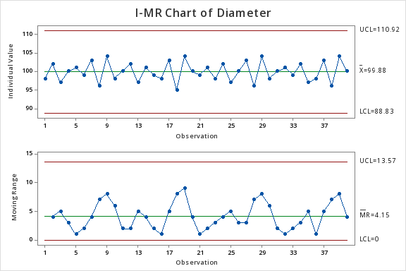
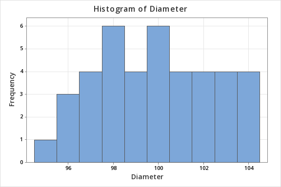
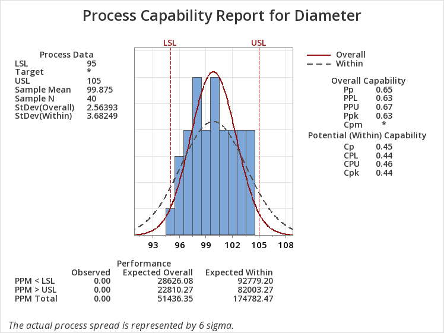
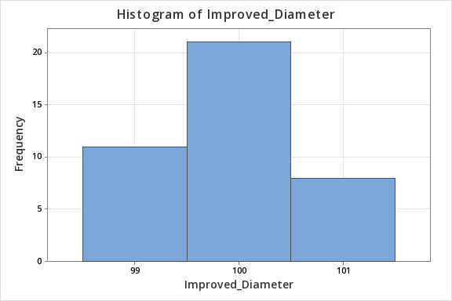
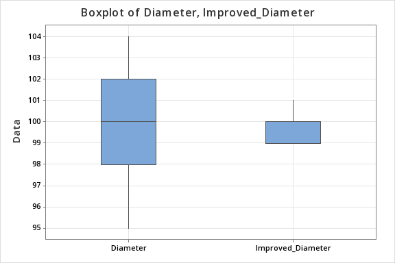
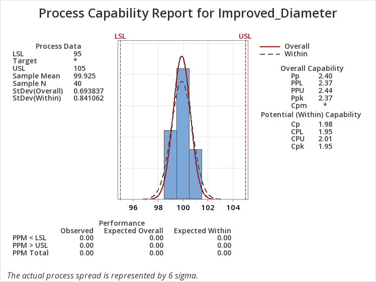

# Process Capability Improvement using Cp/Cpk in Ball Attach Process

## Overview
This project focuses on analyzing and improving process capability in the ball attach stage of semiconductor packaging. The study uses statistical methods to evaluate variation in solder ball diameter and demonstrates how process optimization improves capability and stability.

---

## Objective
- Evaluate process capability using Cp/Cpk  
- Identify process variation and instability  
- Improve process performance by reducing variation  
- Validate improvement using statistical tools  

---

## Process Context
Ball attach is a critical step in semiconductor packaging (BGA), where solder balls are used to form electrical connections between the package and PCB.

Variation in ball diameter can lead to:
- Open/short defects  
- Reliability issues  
- Reduced yield  

---

## Methodology

### 1. Dataset Creation
- Simulated production-like dataset  
- Ball diameter measurements collected  
- Specification limits defined:
  - LSL = 95 µm  
  - USL = 105 µm  

---

## Initial Process Analysis

### Control Chart (I-MR)

### Histogram (Before Improvement)

### Process Capability (Before)

### Key Observations:
- Process is statistically stable  
- High variation observed  
- Process is not capable (Cpk ≈ 0.44)  

---

## Process Improvement

### Histogram (After Improvement)

### Boxplot Comparison

### Process Capability (After)

### Results:
- Significant reduction in variation  
- Improved process consistency  
- High capability achieved (Ppk ≈ 2.37)  

---

## Tools Used
- **Minitab** (Statistical Analysis)
- Statistical methods:
  - Cp/Cpk analysis  
  - Control charts  
  - Histograms  
  - Boxplots  

---

## Key Results

| Metric | Before | After |
|-------|--------|-------|
| Cpk | ≈ 0.44 | — |
| Ppk | — | ≈ 2.37 |
| Variation | High   | Low  |
| Capability | Not Capable  | Highly Capable  |

---

## Detailed Analysis Report

A complete step-by-step analysis of this project, including methodology, graphs, interpretations, and engineering conclusions, is available in the PDF report below:

[View Detailed Analysis](analysis.pdf)

## Key Insight
Reducing process variation is critical for improving process capability and ensuring reliable semiconductor manufacturing.

---

## Conclusion
- A process can be stable but not capable  
- High variation reduces process performance  
- Reducing variation significantly improves capability and yield  

---

## References

- Rao R. Tummala, *Fundamentals of Microsystems Packaging*  
- Rao R. Tummala, *Microelectronics Packaging Handbook*  
- ASM International (EDFAS), *Microelectronics Failure Analysis Desk Reference*  
- NPTEL Course: *Electronics Systems Packaging* by Prof. K. N. Bhat  
- Montgomery, Douglas C., *Introduction to Statistical Quality Control*  
- Minitab Documentation: Statistical Analysis and Process Capability Tools  
- Industry practices based on OSAT manufacturing workflows  

---

## Author
**Hriday Jyoti Borkakati**